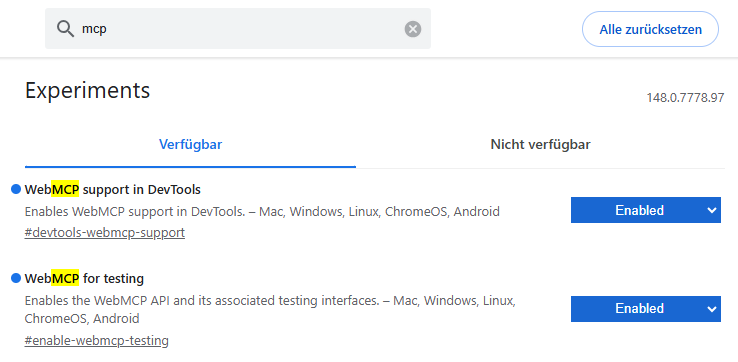

# Browser support

WebMCP is the W3C draft proposed by the Microsoft and Google authors at `webmachinelearning/webmcp`. As of mid-2026, no browser ships it on by default. Chrome and Edge expose it behind feature flags. Firefox and Safari do not ship it yet.

This means: a visitor who lands on a `cf-webmcp`-equipped site in a default-configured browser sees the **disabled** state (or the **pair** state if the site enables the fallback widget). The browser-native flow only fires when the visitor has opted in via the flags below.

This will change. Once Chrome promotes the API to a stable channel and Edge follows, the flags disappear and the producer API just works. Track upstream at [`webmachinelearning/webmcp`](https://github.com/webmachinelearning/webmcp).

## Required flags (Chrome / Edge / Chromium)

Open `chrome://flags` (or `edge://flags`) and enable:

### `#enable-webmcp-testing`

Direct link: [`chrome://flags/#enable-webmcp-testing`](chrome://flags/#enable-webmcp-testing)

Description in the flag UI: *"Enables the WebMCP API and its associated testing interfaces."*

Verified behaviour on Chrome 148:
- Exposes `navigator.modelContext` (producer API). Pages can call `navigator.modelContext.registerTool({ ... })` to register tools.
- Exposes `navigator.modelContextTesting` (consumer API). Headless agents like Cloudflare Browser Run, devtools-driven testing, and similar contexts call `listTools()` / `executeTool(name, jsonArgs)` on this.

This is the **load-bearing flag**. Without it, the `cf-webmcp` bootstrapper finds no `registerTool` method and the `/mcp` page falls back to the pair or disabled state.

### `#devtools-webmcp-support`

Direct link: [`chrome://flags/#devtools-webmcp-support`](chrome://flags/#devtools-webmcp-support)

Description: *"Enables WebMCP support in DevTools."*

Adds a WebMCP panel to Chrome DevTools so you can inspect registered tools and execute them manually. Not required for `cf-webmcp` to function, but useful when developing or debugging tool definitions on a page.

## How to enable

1. Open `chrome://flags?search=mcp` (or `edge://flags?search=mcp`).
2. Find **WebMCP for testing** in the list and set the dropdown to **Enabled**.
3. Optionally enable **WebMCP support in DevTools** for inspection tools.
4. Click **Relaunch** to restart the browser.

After relaunch, your `cf-webmcp` `/mcp` page should show the green **Connected** callout in its diagnostic, and your registered tools are available via `navigator.modelContext` and `navigator.modelContextTesting`.



## Verifying the flag is on

Open devtools console on any page and run:

```js
({
  modelContext: 'modelContext' in navigator,
  registerTool_is_function: typeof navigator.modelContext?.registerTool === 'function',
  modelContextTesting: 'modelContextTesting' in navigator,
  listTools_is_function: typeof navigator.modelContextTesting?.listTools === 'function',
})
```

With both flags enabled in Chrome 148+:

```js
{
  modelContext: true,
  registerTool_is_function: true,
  modelContextTesting: true,
  listTools_is_function: true,
}
```

Any `false` or `undefined` value means the flag is not enabled in the current browser session (or has been reverted by a Chrome update / profile reset).

The same probe runs automatically on `/mcp` and prints its results in the **"Diagnostic: what this page detected"** disclosure at the bottom.

### Or use the WebMCP Inspector extension

The upstream `webmachinelearning/webmcp` project ships an **Inspector** browser extension. Once installed, it surfaces the tools a page has registered, the `<link rel="webmcp">` it advertises, and (where present) the manifest URL. Useful as a one-glance sanity check that your `cf-webmcp` deploy is doing what you expect, without writing a console probe. See the upstream repo for the install link and current limitations.

## What if a visitor doesn't enable the flag

That is the entire reason `fallback_widget = true` exists. With the widget enabled:

- A native-flag visitor → green Connected. Tools auto-registered. No pairing.
- A non-flag visitor with a desktop MCP client (Claude Desktop, Cursor, Claude Code, Windsurf) → blue Pairing required. They install the localhost bridge, paste a token, and connect through the widget.
- A non-flag visitor without a desktop MCP client → red Not connected. No path to use the tools from this browser. They are not the audience.

In short: most real visitors should be on the pair path until browser-native lands in stable. Keep `fallback_widget = true` until at least Chrome stable ships `navigator.modelContext.registerTool`.

## Other browsers

- **Firefox.** No public flag yet. Mozilla's position on WebMCP is still pending as of mid-2026.
- **Safari.** No public flag yet. WebKit has not announced an implementation timeline.
- **Cloudflare Browser Run** lab sessions. WebMCP is on by default in lab sessions per [Cloudflare's WebMCP docs](https://developers.cloudflare.com/browser-run/features/webmcp/). Both `navigator.modelContext` and `navigator.modelContextTesting` are exposed without any flag flip.

## Why the flag and not just ship it

Browser APIs that other surfaces depend on (especially agent APIs that can call into the page) are gated for security review and shape-stability. Once an API ships unflagged, the browser is committed to its shape effectively forever. Flagged-only means the spec authors can still change the surface based on implementation feedback. Expect the flag to disappear when Chrome publishes a stable-channel release with the API on by default.

## What this means for you as a publisher

Until the flag is gone:

- Always set `fallback_widget = true` in production. The widget covers desktop-client visitors who do not have the flag.
- Run preflight before deploy so you know `/mcp` is uncontested on your domain.
- Encourage technical visitors to enable the flag if they want the browser-native path (no token paste). The `/mcp` page's About section links here.
- Test the three states yourself (flag on, flag off + widget on, flag off + widget off) before announcing publicly.
