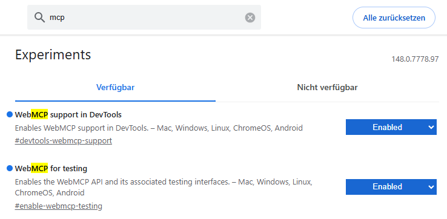

# Browser support

WebMCP is the W3C draft at [`webmachinelearning/webmcp`](https://github.com/webmachinelearning/webmcp). A page registers tools with the browser's WebMCP runtime at `document.modelContext`. cf-webmcp's injected bootstrap does that for the `[[tools]]` in your TOML, and a browser that implements the declarative part of the draft turns the form attributes stamped from `[[forms]]` into tools of its own.

Where it runs, as of 4 October 2026:

| Runtime | How WebMCP is turned on |
|---------|-------------------------|
| Chrome 149 and later | The WebMCP origin trial: the page's response carries a trial token, the visitor does nothing. See [The Chrome origin trial](#the-chrome-origin-trial). |
| Chrome without a token | The flag `chrome://flags/#enable-webmcp-testing`, for local development and testing. See [Local development: the flag](#local-development-the-flag). |
| Cloudflare Kitesurf | Its own WebMCP at `document.modelContext`; the bootstrap's tools register and run there, and stamped form tools are listed (tested 6 October 2026; form tools not invoked). See [Cloudflare Kitesurf and Browser Run](#cloudflare-kitesurf-and-browser-run). |
| Cloudflare Browser Run lab sessions | Chrome with WebMCP turned on; the agent lists and calls tools over the DevTools protocol (tested 6 October 2026). |

We have not checked other browsers. A visitor whose browser has no WebMCP runtime sees the default landing page's "Not connected" state, or "Pairing required" when the site has the fallback widget on (see [Visitors without WebMCP](#visitors-without-webmcp)).

## The API the bootstrap uses

- `document.modelContext.registerTool(definition, { signal })` registers a tool. The bootstrap passes one `AbortController` signal per tool. From Chrome 153, aborting it unregisters the tool; before Chrome 153, aborting it does not.
- `document.modelContext.getTools()` lists the registered tools, and a `toolchange` event on `document.modelContext` fires when the list changes. A name registered twice kills the Chrome renderer (the crash cf-webmcp v0.4.1 recorded as `bad_message` 345, `RFHI_WEBMCP_REGISTER_DUPLICATE_TOOL_NAME`; see [`docs/upgrade.md`](upgrade.md#v041-duplicate-webmcp-tool-name-crash-hardening)), so the bootstrap skips every name already on the page: the `toolname` of an element (a stamped `<form>`, say), a name `getTools()` lists, or a name an earlier run of the bootstrap registered. If `getTools()` has not answered after 1500 ms, it registers without that answer, still skipping the other two kinds.
- Each tool carries the annotations `readOnlyHint`, `untrustedContentHint` and `consequentialHint`, from `[tools.annotations]` or the executor type's defaults. Chrome also reads `debugging` (from Chrome 156); cf-webmcp does not set it.
- Chrome 146 to 149 expose the API as `navigator.modelContext`, now a deprecated alias. The bootstrap and the landing page use `document.modelContext` when it can register tools and fall back to the alias.

## The Chrome origin trial

From Chrome 149, Chrome turns WebMCP on for a page whose HTML response carries a valid token for the WebMCP trial in an `Origin-Trial` header. The visitor sets nothing.

1. Register for the WebMCP trial with your site's origin at the [Chrome Origin Trials console](https://developer.chrome.com/origintrials/) (the address as of 4 October 2026). Sign-up opened on 9 June 2026. The console issues a token.
2. Put the token in your TOML:

   ```toml
   [origin_trial]
   tokens = ["<token from the Chrome Origin Trials console>"]
   ```

3. Build and deploy. `/_webmcp/health` lists each token's feature, expiry and whether it has expired under `origin_trials`, never the token itself.

The Worker sends each token as its own `Origin-Trial` header on:

- every proxied `200` whose `Content-Type` is `text/html`, whether or not the page is injected into (an excluded path, `inject_html = false` and a non-UTF-8 page get it too);
- a `304` that answers a page load (a GET or HEAD whose `Sec-Fetch-Dest` is `document`, `iframe` or `frame`, or whose `Accept` names `text/html`), because a cache updates the copy it has stored with the headers of a `304` ([RFC 9111 section 4.3.4](https://www.rfc-editor.org/rfc/rfc9111#section-4.3.4));
- the landing page (not the redirect that a landing path ending in `/` has).

A token that origin already sends on the response is not added a second time, and the Worker adds the header to no other response. The tokens are part of `INJECTION_HASH`, so changing them changes the `ETag` of rewritten pages and browsers fetch those pages again.

In route-only mode the Worker sees only its own paths, so only the landing page carries the tokens. To turn WebMCP on for your other pages, have origin send the `Origin-Trial` header.

A token that does not fit the page does nothing, and the page gets no error. The build decodes each token with a parser modelled on Chrome's (`TrialToken::Extract`) and fails when a token:

- is malformed;
- is a third-party token (one issued for a script embedded on other sites; we do not expect Chrome to accept it as a header on a page of the origin it names);
- was issued for another origin than the site's (`[site].public_url`, else `https://<[site].domain>`), unless it is a subdomain token for a parent of the site's host with the same scheme and port;
- has expired;
- is listed twice.

A token that expires within 30 days builds with a warning. The build does not check the token's feature name or usage, and not its signature; that is Chrome's job. Build messages name a token by its index; a malformed one is also shown by a prefix of at most 8 characters.

### Apex and www

The build checks every token against one origin, the site's, while a Worker that serves both `example.com` and `www.example.com` sends the same tokens on both hosts. A token for `www.example.com` alone fails the build when the site origin is `https://example.com`, and a token for the apex alone fails it when the site origin is `https://www.example.com`. Register the trial once, for `https://example.com` with subdomains matched (the token's `isSubdomain`). That one token passes the build whichever host is the site origin, and a subdomain token is meant to be accepted on both hosts.

### A development TOML that inherits production

`inherits` copies every top-level block the child does not set, `[origin_trial]` included, and a block the child does set replaces the parent's whole block: a development `[site]` must repeat `domain`, `name` and the other keys it needs. When the development TOML points `[site]` at localhost (`public_url = "http://localhost:8787"`), the production tokens are for another origin and fail the build. Set an empty list in the development TOML and use the flag below in your local Chrome:

```toml
[origin_trial]
tokens = []
```

## Local development: the flag

Without a token, Chrome turns WebMCP on only behind a flag. Use it for local development and testing:

1. Open `chrome://flags/#enable-webmcp-testing`.
2. Set the flag to **Enabled**.
3. Relaunch Chrome.

The screenshot below is from Chrome 148. There the testing flag's description names the API "and its associated testing interfaces", and a second flag enables "WebMCP support in DevTools". cf-webmcp needs neither. Flag names and labels can change between releases.



### Checking a page

Run this in the DevTools console:

```js
({
  document_modelContext: 'modelContext' in document,
  registerTool: typeof document.modelContext?.registerTool,
  getTools: typeof document.modelContext?.getTools,
  navigator_alias: 'modelContext' in navigator,
  navigator_alias_registerTool: typeof navigator.modelContext?.registerTool,
  modelContextTesting: 'modelContextTesting' in navigator,
})
```

`registerTool: "function"` means the page has the WebMCP runtime at `document.modelContext`. On Chrome 146 to 149 look at `navigator_alias_registerTool` instead; reading the alias may log a deprecation warning in the console. Where `getTools` is `"function"`, `await document.modelContext.getTools()` on a page the Worker injected into lists the tools the bootstrap registered. The default landing page runs similar checks and shows them under **"Diagnostic: what this page detected"**.

## Cloudflare Kitesurf and Browser Run

- **Kitesurf**, Cloudflare's agent browser (part of Browser Run, a free beta as of 4 October 2026), has its own WebMCP implementation at `document.modelContext` and needs no lab session. We tested cf-webmcp v0.6.0 there on 6 October 2026, on webmcp.basgr.com (user agent `Kitesurf/0.0.1`), driven by `chrome-devtools-mcp` 1.10.1 with `--category-experimental-webmcp` against `wss://api.cloudflare.com/client/v4/accounts/<ACCOUNT_ID>/browser-run/devtools/browser?browser=kitesurf`:
  - The bootstrap registered the site's three `[[tools]]` on the home page, on a page with forms and on the landing page, and `getTools()` listed them.
  - `search_pages`, `list_posts` and `get_page`, called with `execute_webmcp_tool`, completed and returned the executor's `ok: true` answer.
  - Both forms on the forms page showed up as tools: the one cf-webmcp stamps from `[[forms]]` and one stamped by hand in the page's HTML, each with an input schema built from its params (all required, the email field with `format: "email"`). We did not call them; the test only listed them.
  - The landing page showed its connected state with the pairing steps hidden, and `list_console_messages` returned no messages for it.
  - `navigator.modelContext` had no `registerTool`, and `navigator.modelContextTesting` was undefined in the page.
- **Browser Run lab sessions** (`wrangler browser create --lab`, or `lab=true` on the DevTools URL) run Chrome with WebMCP turned on. The same test in a lab session on 6 October 2026 (`HeadlessChrome/152`) gave the same results, `navigator.modelContextTesting` included (undefined in the page), except that the form tools' email field had no `format: "email"`. The agent lists and calls the page's tools over the DevTools protocol (`list_webmcp_tools` and `execute_webmcp_tool` in `chrome-devtools-mcp`). See [Cloudflare's WebMCP docs for Browser Run](https://developers.cloudflare.com/browser-run/features/webmcp/) (the address as of 6 October 2026).

## The `tools` Permissions Policy

WebMCP is controlled by the Permissions Policy feature `tools`, whose default allowlist is `self`. In the usual meaning of `self`, a page and its same-origin frames can use WebMCP, and a cross-origin frame only when the embedding page delegates it. A response header `Permissions-Policy: tools=()` turns WebMCP off for that page, so the bootstrap's tools should not register there.

cf-webmcp neither sets nor changes `Permissions-Policy`. A proxied page keeps the header origin sent, and the Worker's own responses, the landing page included, send none. If tools never appear on a page, check whether origin, a plugin or a response header rule at Cloudflare sends `tools=()`.

## Visitors without WebMCP

That is what `fallback_widget = true` is for. The widget is opt-in (off by default) and has [known limits](deployment.md#known-limits-of-the-desktop-bridge). The default landing page shows one of three states:

- A browser with WebMCP (Chrome with the trial token or the flag, Kitesurf): green **Connected**. The default landing page registers the tools itself (a custom template does when it includes `{{bootstrap_block}}`); no pairing.
- No WebMCP and the widget on (`fallback_widget = true` and a widget pinned in the build): blue **Pairing required**. A visitor with a desktop MCP client (Claude Desktop, Cursor, Claude Code, Windsurf) starts the bridge in a terminal with `--foreground`, adds it to their MCP client, pastes a pairing token into the widget, and keeps the terminal open while they use the tools. The widget disconnects after 30 minutes without mouse movement, clicks, key presses or scrolling on the page.
- No WebMCP and no widget: red **Not connected**. There is no path to the tools from this browser.

## What this means for you as a publisher

- Register the WebMCP origin trial and put the token in `[origin_trial].tokens`. That is what turns WebMCP on for Chrome visitors on the pages the Worker proxies and on the landing page. In route-only mode only the landing page carries the tokens; have origin send the `Origin-Trial` header on your other pages.
- Consider `fallback_widget = true` if desktop-client visitors without WebMCP matter to you. It needs `npm run upload-widget` before deploy (and `npm run update-widget` first when the vendored widget file is missing) and a bridge program on the visitor's computer, with [known limits](deployment.md#known-limits-of-the-desktop-bridge).
- Run preflight before deploy so you know `/mcp` is uncontested on your domain.
- Test the states yourself (token or flag on, widget on, widget off) before announcing publicly.
